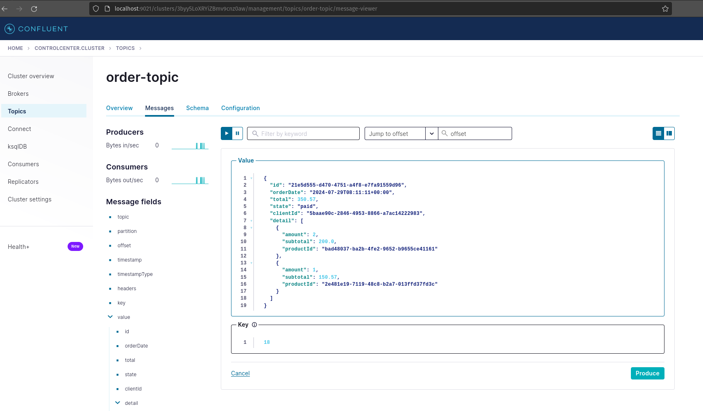

# BROKER SERVICE
## REQUISITOS
- Instalar docker y docker-compose
- Esperar a que todos los servicios esten inicializados

## PASOS

### 1. Ubicarse en la raiz y ejecutar el siguiente comando:
```
docker-compose up --build -d
```
### 2. Registrar cliente
1. Ingresar a http://localhost:7002/graphql
2. Ingrese ejecutar operacion

Operation
```
mutation Mutation($createCustomerInput: CreateCustomerInput!) {
  createCustomer(createCustomerInput: $createCustomerInput) {
    _id
    address
    lastName
    name
    phone
  }
}
```
Variables
```
  {
    "createCustomerInput": {
    "_id": "5baae90c-2846-4953-8866-a7ac14222983",
    "name": "Angel Joel",
    "lastName": "Alvarado",
    "address": "Lima",
    "phone": "98789012"
    }
  }

```
### 3. Registrar productos
```
curl --location 'http://0.0.0.0:7001/product' \
--header 'Content-Type: application/json' \
--data '{
"product_id": "a9c7ea48-0c3f-427b-bfa4-ba205fdc2f7f",
"description": "Sansung galaxy a21",
"price": 150.57,
"category": "TEC",
"created_at": "2024-07-29T08:11:11+00:00",
"updated_at": "2024-07-29T08:11:11+00:00",
"deleted_at": null
}'
```
```
curl --location 'http://0.0.0.0:7001/product' \
--header 'Content-Type: application/json' \
--data '{
"product_id": "815da826-e630-4e77-bdd2-64c168c65589",
"description": "Sansung galaxy a15",
"price": 100,
"category": "TEC",
"created_at": "2024-07-29T08:11:11+00:00",
"updated_at": "2024-07-29T08:11:11+00:00",
"deleted_at": null
}'
```
### 4. Ingresar a la consola de kafka http://localhost:9021
- crear el siguiente topico
```
order-topic
```
- Enviar mensaje
```
{
  "id": "21e5d555-d470-4751-a4f8-e7fa91559d96",
  "orderDate": "2024-07-29T08:11:11+00:00",
  "total": 350.57,
  "state": "paid",
  "clientId": "5baae90c-2846-4953-8866-a7ac14222983",
  "detail": [
    {
      "amount": 2,
      "subtotal": 200.0,
      "productId": "a9c7ea48-0c3f-427b-bfa4-ba205fdc2f7f"
    },
    {
      "amount": 1,
      "subtotal": 150.57,
      "productId": "815da826-e630-4e77-bdd2-64c168c65589"
    }
  ]
}
```
# IMAGEN REFERENCIAL
